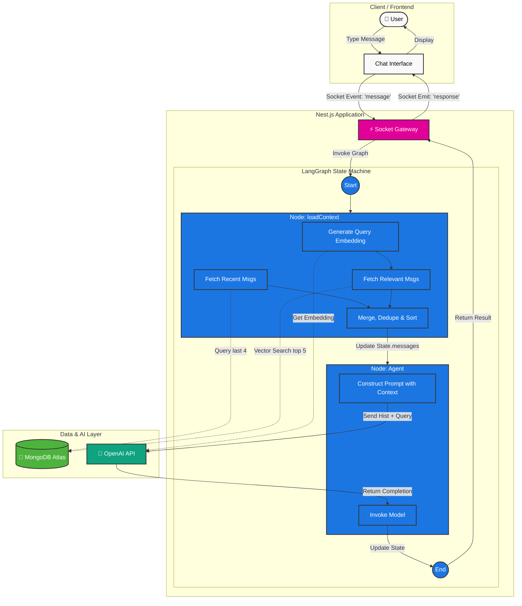

## Introduction

Building a "Hello World" chatbot with an LLM is easy today. Building a chatbot that remembers context across a long conversation without blowing up your token budget or confusing the model? That’s where the real engineering begins.

As TypeScript developers, we often watch the Python ecosystem have all the fun with advanced AI orchestration. But with the release of **LangGraph.js**, we now have native tools to build complex, stateful, agentic workflows right in our Node.js backends.

In this post, I’m going to walk through how I re-architected a chatbot service using **Nest.js** and **LangGraph.js**. I'll share how I moved away from blindly injecting entire conversation histories and implemented a "Smart Context" RAG approach using **MongoDB Atlas Vector Search**.

## The Challenge: The "Infinite Scroll" Problem

Initially, my approach to handling chat history was simple: When a user sent a message, I fetched the entire session history from MongoDB and stuffed it into the prompt.

This works for 5 turns. It fails at 50.

1. **Cost & Latency:** Sending 10k tokens of history for every single user query is expensive and slow.
2. **Model Distraction:** LLMs suffer from the "lost in the middle" phenomenon. When you feed them too much irrelevant noise from 20 minutes ago, they lose focus on the user's *current* intent.

I needed a way to give the model **only what it needs** at that exact moment.

## The Solution: LangGraph as the State Manager

I chose LangGraph.js because it treats the conversation flow as a graph, where the state is passed between nodes.

Instead of my Nest.js controller desperately trying to manage history, embeddings, and API calls, I push that complexity down into the graph itself. The Nest controller now has one job: pass the user input to the graph and that's it.

### The Architecture: Hybrid "Smart Context"

To solve the context problem, I couldn't just rely on Vector Search (RAG). Vector search is great for finding *relevant* info from long ago, but it sometimes misses the immediate context of what was just said.

I implemented a **Hybrid Strategy** inside the graph:

1. **Recency (Immediate Context):** Fetch the last  messages (e.g., last 4 turns) via a standard database query. This ensures the bot knows the immediate flow.
2. **Relevance (Deep Memory):** Perform a Vector Search on the conversation history to find the top  messages historically relevant to the *current* query.
3. **Merge & Dedupe:** Combine these results, remove duplicates, and sort them chronologically to maintain narrative flow.

*[Idea for an image here: A diagram showing User Input -> [Graph Start] -> [Load Smart Context Node] -> (Parallel: DB Query Last 4 + Vector Search Top 5) -> Merge/Sort -> [Agent Node] -> Output]*



## The Implementation (Show Me The Code)

Our stack is TypeScript all the way down: Nest.js for the API, Mongoose for ODM, and LangChain/LangGraph for AI.

### 1. The State Schema

Every LangGraph implementation starts with defining the state. This is the "memory" that gets passed around. (This is just a basic schema, you can update it according to your requirement)

```typescript
// state.ts
import { StateSchema, MessagesValue } from "@langchain/langgraph";
// z is Zod
export const StateAnnotation = new StateSchema({
    // LangGraph's built-in reducer for managing chat history
    messages: MessagesValue,
    // We track the current query separately
    currentQuery: z.string(),
    // Other metadata...
    sessionId: z.string(),
});

```

### 2. The Hero Node: Loading Smart Context

This is where the magic happens. Instead of pre-loading data in the controller, this graph node is responsible for fetching its own state.

We use MongoDB Atlas because it allows us to perform standard Mongoose queries *and* vector similarity searches on the same collection.

```typescript
// nodes/loadContext.ts
import { HumanMessage, SystemMessage } from "@langchain/core/messages";
// ... import your Mongoose models and Vector Service

export const loadContextNode = async (state: typeof StateAnnotation.State) => {
  const { currentQuery, sessionId } = state;

  // A. RECENCY: Fetch immediate context using standard Mongoose
  const recentDocsRaw = await MessagesModel.find({ session: sessionId })
    .sort({ createdAt: -1 })
    .limit(4)
    .lean();

  // B. RELEVANCE: Fetch historical context using Vector Search
  // vectorStoreService wraps MongoDBAtlasVectorSearch
  const relevantDocsRaw = await vectorStoreService.similaritySearch(
    currentQuery, 
    5, // Top 5 relevant messages
    { preFilter: { session: { $eq: sessionId } } } // Crucial: Only search this user's history!
  );

  // C. MERGE & DEDUPE (The secret sauce)
  // We use a Map to ensure we don't have the same message twice if it's both recent AND relevant.
  const allDocsMap = new Map();

  // Helper to normalize Mongoose vs LangChain document shapes...
  // [Implementation of normalization logic here...]

  recentDocsRaw.forEach(doc => allDocsMap.set(doc._id.toString(), normalizeDoc(doc)));
  relevantDocsRaw.forEach(doc => {
     const normalized = normalizeDoc(doc);
     if (!allDocsMap.has(normalized._id.toString())) {
         allDocsMap.set(normalized._id.toString(), normalized);
     }
  });

  // Sort chronologically so the LLM understands the timeline
  const uniqueDocs = Array.from(allDocsMap.values())
    .sort((a, b) => new Date(a.createdAt).getTime() - new Date(b.createdAt).getTime());

  // Convert to LangChain Message format
  const historyMessages = uniqueDocs.map(doc => 
    doc.name === 'Admin' ? new SystemMessage(doc.body) : new HumanMessage(doc.body)
  );

  // Update the state!
  // We replace the history with our smart selection + the new query
  return { 
    messages: [...historyMessages, new HumanMessage(currentQuery)]
  };
};

```

### 3. Defining the Graph Flow

Tying it together is incredibly simple. I have added just few basic nodes for sake of simplicity.

```typescript
// graph.ts
import { StateGraph, END } from "@langchain/langgraph";

const workflow = new StateGraph(StateAnnotation)
  // Add our smart context node
  .addNode("loadContext", loadContextNode)
  // Add the node that actually calls the LLM
  .addNode("agent", callModelNode) 

  // Define the flow: Start -> Load Context -> Call Agent -> End
  .addEdge("__start__", "loadContext")
  .addEdge("loadContext", "agent")
  .addEdge("agent", END);

export const app = workflow.compile();

```

Now, my Nest.js controller is beautifully dumb. It just invokes the graph with the user's input, and the graph handles the complex retrieval logic.

## Results and Benefits

By moving to this architecture, we achieved significant improvements:

1. **Token Efficiency:** Instead of sending 50 messages, we send an optimized 9-10 messages (4 recent + 5 relevant). This slashed our OpenAI API costs.
2. **Better Responses:** The model is less distracted by irrelevant history and focuses on the data that matters for the current query.
3. **Clean Architecture:** The logic for *how* to retrieve data is encapsulated within the AI application boundary, not leaking into the API layer.

## What's Next?

This "Retrieval Graph" is just the foundation. Since we are using LangGraph, it provides lots of useful tools which we can use to optimize our Agentic work flow. Here are few of them that we can create using Langgraph.js

* **Adding Tools:** Giving the bot the ability to fetch real-time data (e.g., weather, stock prices) if the answer isn't in the chat history.
* **Self-Correction:** Adding a "Grader" node to evaluate if the retrieved context is actually useful before generating an answer, and re-searching if necessary.

The TypeScript AI ecosystem is maturing rapidly, and patterns like this prove we can build production-grade, sophisticated AI applications without leaving the language we love.